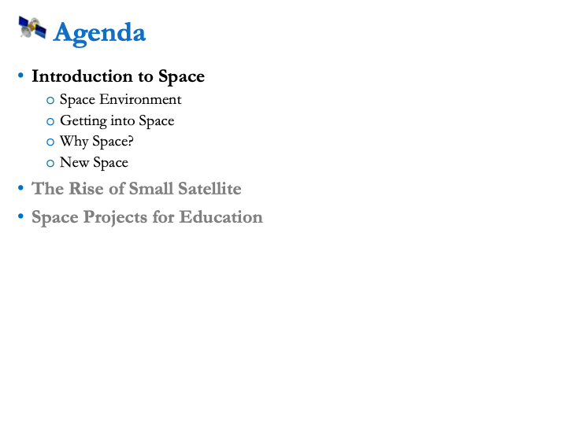
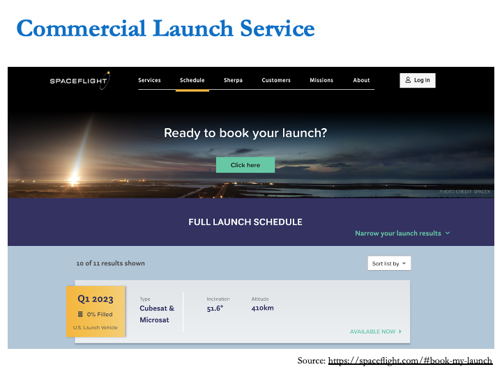

# Intro to Small Satellites and Their Applications

## Poster

This episode will offer a close look at small satellites, what they are, their applications and benefits, and how they have been used to promote space and STEM education for fostering and kick-starting indigenous space programs in many countries around the world.

Date: Wednesday, 2nd March, 2022
Time: 12:00 PM – 1:00 PM
Speaker: Mr. Morokot Sakal 
Platform: Zoom

## Slides

